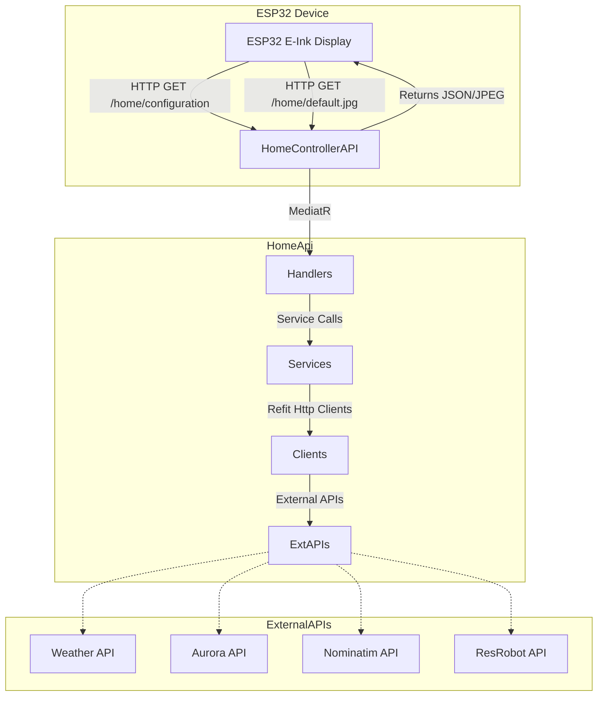

[](https://github.com/myxelium/homescreen "Go to GitHub repo")
[](https://github.com/myxelium/homescreen)
[](https://github.com/myxelium/homescreen)
[](https://github.com/myxelium/homescreen/releases/)
[](https://www.gnu.org/licenses/gpl-3.0.en.html)
[](https://github.com/myxelium/homescreen/issues)
[](https://github.com/Myxelium/HomeScreen/actions/workflows/build.yml)
# What why how
This is a project I created that pulls weather data from the internet, transforms it into custom images, and displays them on an e-ink screen powered by an ESP32.

## What This Project Does

I wanted a low-power way to see weather information at a glance, so I built this system that:

- Fetches real-time weather data from online APIs
- Processes and converts the data into visual images (temperature graphs, forecast icons, etc.)
- Sends these images wirelessly to an ESP32 microcontroller
- Displays the information on an energy-efficient e-ink screen
- Updates periodically while consuming minimal power


## Git Notes
All commits has to follow this [Conventional Commits style](https://www.conventionalcommits.org/) to pass the pipeline.
## Features 😺
- Display current weather data
- Display public transport information
- Display time and date

## Requirements 🫥
- [ESP32 board](https://www.waveshare.com/wiki/E-Paper_ESP32_Driver_Board)
- [E-ink display (e.g. Waveshare 7.5 inch)](https://www.waveshare.com/7.5inch-e-paper-hat.htm)

# Installation

This section provides instructions for setting up and running the HomeApi project.

## Prerequisites

- [.NET 9.0 SDK](https://dotnet.microsoft.com/download/dotnet/9.0) or later
- Docker (optional, for containerized deployment)
- Git (to clone the repository)

## Option 1: Local Development Setup

1. Clone the repository:
   ```bash
   git clone https://github.com/Myxelium/HomeScreen.git
   cd HomeApi
   ```

2. Restore dependencies:
   ```bash
   dotnet restore
   ```

3. Build the project:
   ```bash
   dotnet build
   ```

4. Run the application:
   ```bash
   dotnet run
   ```

The API will be available at `http://localhost:5000`.

## Option 2: Docker Deployment

1. Build the Docker image:
   ```bash
   docker build -t homeapi .
   ```

2. Run the container:
   ```bash
   docker run -d -p 5000 --name homeapi homeapi
   ```

The API will be accessible at `http://localhost:5000`.

## Configuration

The application uses the standard .NET configuration system. You can modify settings in:

- `appsettings.json` - Default configuration
- `appsettings.Development.json` - Development environment configuration

API endpoints:
- Weather data: GET `/home`
- Generated image: GET `/home/default.jpg`
- Configuration data: GET `/home/configuration`
- Departure board: GET `/home/departure-board`

## API Documentation

When running, API documentation is available through Scalar at `/scalar`.



# ESP32 configuration and building


Best way of getting the ESP32 ready for code upload is to follow this guide [WAVESHARE ESP32 GUIDE](https://web.archive.org/web/20250706150325/https://www.waveshare.com/wiki/E-Paper_ESP32_Driver_Board).
Once you have it ready so you can upload code to it copy my code in: Esp32_Code/INFOSCREEN_WITH_INTERVAL from this repo.

Install following libraries (if more is needed search for them and install them too): 
* ArduinoJson
* GUI_Paint
* JPEGDEC

You need the Waveshare examples installed since it uses code from them download them here [Download](https://files.waveshare.com/upload/5/50/E-Paper_ESP32_Driver_Board_Code.7z) or check above link.
